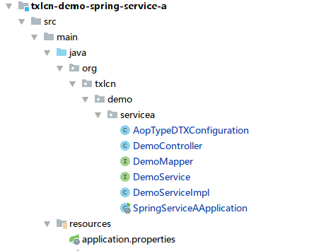
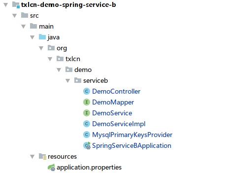
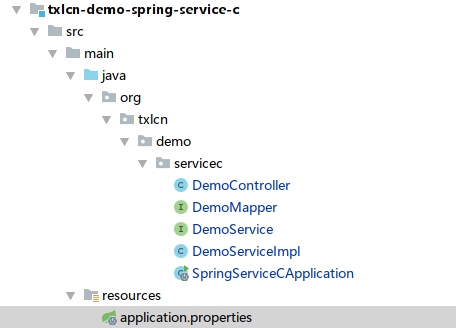

# SpringCloud示例

SpringCloud 示例说明  
共三个模块如下：  
SpringServiceA (发起方 | LCN模式)     
SpringServiceB (参与方 | TXC模式)  
SpringServiceC (参与方 | TCC模式)  

代码地址:https://github.com/codingapi/txlcn-demo

## 一、调用关系说明:

1. SpringServiceA -> DemoController的`txlcn`的Mapping是调用发起方法，代码如下。

```java
@RestController
public class DemoController {

    private final DemoService demoService;

    @Autowired
    public DemoController(DemoService demoService) {
        this.demoService = demoService;
    }

    @RequestMapping("/txlcn")
    public String execute(
            @RequestParam("value") String value,
            @RequestParam(value = "ex", required = false) String exFlag) {
        return demoService.execute(value, exFlag);
    }
}

```

2. demoService.execute(value, exFlag)代码:   
```java

@Service
@Slf4j
public class DemoServiceImpl implements DemoService {

    private final DemoMapper demoMapper;

    private final ServiceBClient serviceBClient;

    private final ServiceCClient serviceCClient;

    @Autowired
    public DemoServiceImpl(
            ClientDemoMapper demoMapper,
            ServiceBClient serviceBClient,
            ServiceCClient serviceCClient) {
        this.demoMapper = demoMapper;
        this.serviceBClient = serviceBClient;
        this.serviceCClient = serviceCClient;
    }

    @Override
    @LcnTransaction
    public String execute(String value) {

        // ServiceB
        String dResp = serviceBClient.rpc(value);

        // ServiceC
        String eResp = serviceCClient.rpc(value);

        // Local transaction
        Demo demo = new Demo();
        demo.setGroupId(DTXLocalContext.getOrNew().getGroupId());  
        demo.setDemoField(value);
        demo.setAppName(Transactions.APPLICATION_ID_WHEN_RUNNING);
        demo.setCreateTime(new Date());
        demoMapper.save(demo);

        // 置异常标志，DTX 回滚
        if (Objects.nonNull(exFlag)) {
            throw new IllegalStateException("by exFlag");
        }
        return dResp + " > " + eResp + " > " + "ok-service-a";
    }
}
```

3. ServiceBClient.rpc(value)代码:
 ```java
@Service
@Slf4j
public class DemoServiceImpl implements DemoService {

    private final DemoMapper demoMapper;


    @Autowired
    public DemoServiceImpl(DemoMapper demoMapper) {
        this.demoMapper = demoMapper;
    }

    @Override
    @TxcTransaction(propagation = DTXPropagation.SUPPORTS)
    @Transactional
    public String rpc(String value) {
        Demo demo = new Demo();
        demo.setGroupId(TracingContext.tracing().groupId());
        demo.setDemoField(value);
        demo.setAppName(Transactions.getApplicationId());
        demo.setCreateTime(new Date());
        demoMapper.save(demo);
        return "ok-service-b";
    }
}

```
4. ServiceCClient.rpc(value)代码：
 
```java
@Service
@Slf4j
public class DemoServiceImpl implements DemoService {

    private final DemoMapper demoMapper;

    private ConcurrentHashMap<String, Long> ids = new ConcurrentHashMap<>();

    @Autowired
    public DemoServiceImpl(DemoMapper demoMapper) {
        this.demoMapper = demoMapper;
    }

    @Override
    @TccTransaction(propagation = DTXPropagation.SUPPORTS)
    @Transactional
    public String rpc(String value) {
        Demo demo = new Demo();
        demo.setDemoField(value);
        demo.setCreateTime(new Date());
        demo.setAppName(Transactions.getApplicationId());
        demo.setGroupId(TracingContext.tracing().groupId());
        demoMapper.save(demo);
        ids.put(TracingContext.tracing().groupId(), demo.getId());
        return "ok-service-c";
    }

    public void confirmRpc(String value) {
        log.info("tcc-confirm-" + TracingContext.tracing().groupId());
        ids.remove(TracingContext.tracing().groupId());
    }

    public void cancelRpc(String value) {
        log.info("tcc-cancel-" + TracingContext.tracing().groupId());
        Long kid = ids.get(TracingContext.tracing().groupId());
        demoMapper.deleteByKId(kid);
    }
}

```
## 二、工程代码概览
1. 事务发起方，txlcn-demo-spring-service-a
* 工程截图   
  
* 项目配置文件 application.properties     
```properties
##################
# 这个是启动本服务的配置文件，其它的application-xxx.properties 是开发者的个性化配置，不用关心。
# 你可以在 https://txlcn.org/zh-cn/docs/setting/client.html 看到所有的个性化配置
#################

spring.application.name=txlcn-demo-spring-service-a
server.port=12011
spring.datasource.driver-class-name=com.mysql.jdbc.Driver
## TODO 你的配置
spring.datasource.url=jdbc:mysql://127.0.0.1:3306/txlcn-demo?\
characterEncoding=UTF-8&serverTimezone=UTC
spring.datasource.username=root
spring.datasource.password=root
spring.datasource.hikari.maximum-pool-size=20
mybatis.configuration.map-underscore-to-camel-case=true
mybatis.configuration.use-generated-keys=true

logging.level.com.codingapi.txlcn=DEBUG

# 关闭Ribbon的重试机制（如果有必要）
ribbon.MaxAutoRetriesNextServer=0
ribbon.ReadTimeout=5000
ribbon.ConnectTimeout=5000

```
* 启动类
```java
@SpringBootApplication
@EnableDiscoveryClient
@EnableDistributedTransaction
public class SpringServiceAApplication {

    public static void main(String[] args) {
        SpringApplication.run(SpringServiceAApplication.class, args);
    }
}

```

2. 事务参与方，txlcn-demo-spring-service-b
* 工程截图  
     
* 项目配置文件 application.properties  
```properties
##################
# 这个是启动本服务的配置文件，其它的application-xxx.properties 是开发者的个性化配置，不用关心。
# 你可以在 https://txlcn.org/zh-cn/docs/setting/client.html 看到所有的个性化配置
#################

spring.application.name=txlcn-demo-spring-service-b
server.port=12002
spring.datasource.type=com.alibaba.druid.pool.DruidDataSource
spring.datasource.driver-class-name=com.mysql.jdbc.Driver
## TODO 你的配置
spring.datasource.url=jdbc:mysql://127.0.0.1:3306/txlcn-demo\
  ?characterEncoding=UTF-8&serverTimezone=UTC
spring.datasource.username=root
spring.datasource.password=root
#spring.datasource.hikari.maximum-pool-size=20
mybatis.configuration.map-underscore-to-camel-case=true
mybatis.configuration.use-generated-keys=true

logging.level.com.codingapi.txlcn=DEBUG

```
* 启动类
```java
@SpringBootApplication
@EnableDiscoveryClient
@EnableDistributedTransaction
public class SpringServiceBApplication {

    public static void main(String[] args) {
        SpringApplication.run(SpringServiceBApplication.class, args);
    }
}

```
3. 事务参与方，txlcn-demo-spring-service-c
* 工程截图  
  
* 项目配置文件 application.properties  
```properties
##################
# 这个是启动本服务的配置文件，其它的application-xxx.properties 是开发者的个性化配置，不用关心。
# 你可以在 https://txlcn.org/zh-cn/docs/setting/client.html 看到所有的个性化配置
#################

spring.application.name=txlcn-demo-spring-service-c
server.port=12003
spring.datasource.driver-class-name=com.mysql.jdbc.Driver

## TODO 你的配置
spring.datasource.url=jdbc:mysql://127.0.0.1:3306/txlcn-demo\
  ?characterEncoding=UTF-8&serverTimezone=UTC
spring.datasource.username=root
spring.datasource.password=root
spring.datasource.hikari.maximum-pool-size=20
mybatis.configuration.map-underscore-to-camel-case=true
mybatis.configuration.use-generated-keys=true

logging.level.com.codingapi.txlcn=DEBUG

```
* 启动类
```java
@SpringBootApplication
@EnableDiscoveryClient
@EnableDistributedTransaction
public class SpringServiceCApplication {

    public static void main(String[] args) {
        SpringApplication.run(SpringServiceCApplication.class, args);
    }
}

```

## 三、启动SpringCloud微服务
事务参与方 ServiceB  

事务参与方 ServiceC  

事务发起方 ServiceA  

